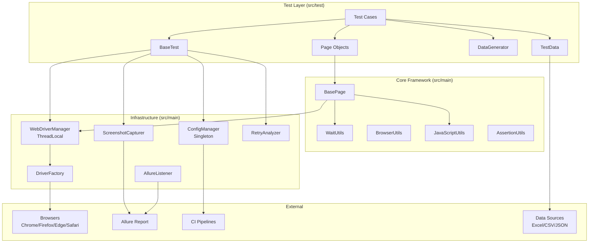
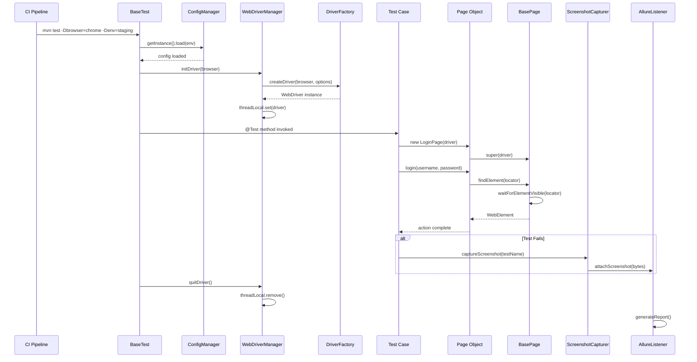
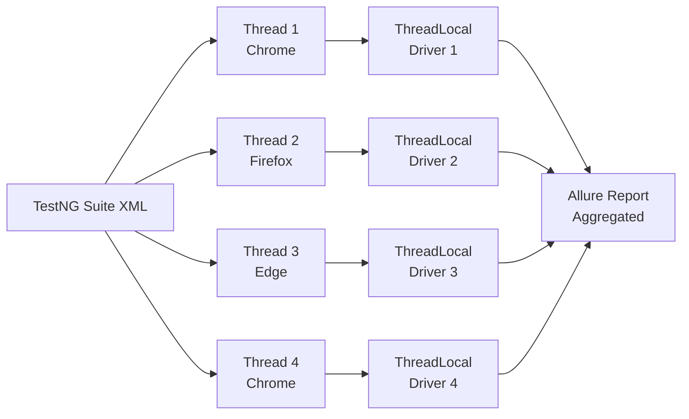

# Design Document: Selenium Test Framework

## Overview

Framework tự động hóa kiểm thử Selenium được thiết kế theo mindset SDET chuyên nghiệp, cung cấp nền tảng vững chắc để viết, tổ chức và thực thi các bài kiểm thử UI tự động. Framework áp dụng các nguyên tắc kỹ thuật phần mềm hiện đại: Page Object Model (POM), Singleton, Factory, ThreadLocal isolation, và Data-Driven Testing.

**Mục tiêu thiết kế:**
- Tách biệt hoàn toàn giữa test logic, browser control, và configuration
- Thread-safe để hỗ trợ parallel execution không giới hạn
- Extensible: thêm browser mới, data source mới, hoặc reporter mới mà không sửa core
- Zero-config CI: chạy được ngay trên GitHub Actions, Jenkins, GitLab CI

**Tech Stack:**
| Thành phần | Công nghệ |
|---|---|
| Build tool | Maven |
| Test runner | TestNG |
| Browser automation | Selenium WebDriver 4.x |
| Driver management | WebDriverManager (io.github.bonigarcia) |
| Reporting | Allure Report |
| Logging | Log4j2 / SLF4J |
| Data generation | Java Faker |
| CI/CD | GitHub Actions, Jenkins, GitLab CI |

---

## Architecture

### High-Level Architecture

Framework được tổ chức theo kiến trúc phân lớp 4 tầng:

```
┌─────────────────────────────────────────────────────────────┐
│                     TEST LAYER (src/test)                    │
│  BaseTest ← Tests (TestNG)    Pages (Page Objects)          │
│  DataGenerator, TestData      DataProviders                  │
└──────────────────────────┬──────────────────────────────────┘
                           │ extends / uses
┌──────────────────────────▼──────────────────────────────────┐
│                   CORE FRAMEWORK (src/main)                  │
│  BasePage          WaitUtils        AssertionUtils           │
│  BrowserUtils      JavaScriptUtils  FileUtils                │
└──────────────────────────┬──────────────────────────────────┘
                           │ uses
┌──────────────────────────▼──────────────────────────────────┐
│               INFRASTRUCTURE LAYER (src/main)                │
│  DriverFactory     WebDriverManager  ConfigManager           │
│  ScreenshotCapturer  RetryAnalyzer   AllureListener          │
└──────────────────────────┬──────────────────────────────────┘
                           │ integrates
┌──────────────────────────▼──────────────────────────────────┐
│                   EXTERNAL SYSTEMS                           │
│  Chrome/Firefox/Edge/Safari   Allure Report   CI Pipelines  │
│  Excel/CSV/JSON test data     Log4j2 / SLF4J                │
└─────────────────────────────────────────────────────────────┘
```

### Component Diagram (Mermaid)



### Data Flow: Test Execution



### Parallel Execution Flow



---

## Components and Interfaces

### 1. ConfigManager

**Pattern:** Singleton  
**Trách nhiệm:** Đọc và cung cấp cấu hình runtime từ `config.properties`, hỗ trợ override qua system properties và environment variables.

**Priority chain (cao → thấp):**
1. System properties (`-Dbrowser=chrome`)
2. Environment variables (`BROWSER=chrome`)
3. Profile-specific properties (`config-staging.properties`)
4. Default properties (`config.properties`)

### 2. DriverFactory

**Pattern:** Factory Method  
**Trách nhiệm:** Tạo WebDriver instance phù hợp với browser được chỉ định, cấu hình options (headless, window size, etc.).

**Supported browsers:** `chrome`, `firefox`, `edge`, `safari`

### 3. WebDriverManager (custom)

**Pattern:** ThreadLocal wrapper  
**Trách nhiệm:** Quản lý vòng đời WebDriver instance theo từng thread, đảm bảo thread-safety khi chạy parallel.

> **Lưu ý:** Class này là custom wrapper, không phải thư viện `io.github.bonigarcia.wdm.WebDriverManager`. Thư viện bonigarcia được gọi bên trong `DriverFactory`.

### 4. BasePage

**Pattern:** Template Method  
**Trách nhiệm:** Lớp cha trừu tượng cho tất cả Page Objects, đóng gói WebDriver interactions với Explicit Wait tích hợp.

### 5. BaseTest

**Pattern:** Template Method + Hook  
**Trách nhiệm:** Lớp cha trừu tượng cho tất cả Test Cases, quản lý setup/teardown qua TestNG lifecycle annotations.

### 6. RetryAnalyzer

**Pattern:** Strategy  
**Trách nhiệm:** Phân tích kết quả test và quyết định có retry hay không dựa trên loại exception và số lần retry còn lại.

### 7. ScreenshotCapturer

**Trách nhiệm:** Chụp ảnh màn hình khi test thất bại và đính kèm vào Allure report.

### 8. AllureListener

**Pattern:** Observer (TestNG ITestListener)  
**Trách nhiệm:** Lắng nghe TestNG events và ghi thông tin vào Allure report.

### 9. Utility Classes

| Class | Trách nhiệm |
|---|---|
| `WaitUtils` | Explicit wait helpers (visible, clickable, invisible, text) |
| `BrowserUtils` | Tab management, alert handling, iframe switching, screenshot |
| `JavaScriptUtils` | JS execution, scroll, highlight, attribute retrieval |
| `AssertionUtils` | Wrapped assertions với descriptive messages |
| `FileUtils` | File read/write/check trong `target/` |
| `DataGenerator` | Java Faker wrapper cho test data generation |

---

## Data Models

### ConfigurationModel

```
ConfigurationModel {
    baseUrl: String           // Required
    browser: String           // Required: chrome|firefox|edge|safari
    headless: boolean         // Default: false
    implicitWaitTimeout: int  // Default: 0 (seconds)
    explicitWaitTimeout: int  // Default: 10 (seconds)
    threadCount: int          // Default: 1
    screenshotOnFailure: boolean // Default: true
    retryCount: int           // Default: 1
    env: String               // Default: dev
    ciMode: boolean           // Default: false
}
```

### TestResultModel (Allure)

```
TestResultModel {
    testName: String
    browser: String
    status: PASSED | FAILED | SKIPPED
    startTime: long (epoch ms)
    endTime: long (epoch ms)
    errorMessage: String?
    stackTrace: String?
    screenshotPath: String?
    retryCount: int
    threadId: long
}
```

### DataRecord (Data-Driven)

```
DataRecord {
    source: String            // file path
    sheetName: String?        // Excel only
    rowIndex: int
    data: Map<String, Object> // column name → value (String|Integer|Boolean|Double)
}
```

### DriverContext (ThreadLocal)

```
DriverContext {
    driver: WebDriver
    browser: String
    threadId: long
    sessionId: String
}
```

---

## Low-Level Design

### ConfigManager — Class Signature

```java
package core.config;

public final class ConfigManager {

    private static volatile ConfigManager instance;
    private final Properties properties;

    private ConfigManager() { /* load properties */ }

    // Double-checked locking Singleton
    public static ConfigManager getInstance();

    // Load profile-specific config
    public void loadConfig(String env);

    // Type-safe getters — throw MissingConfigException if required key absent
    public String getString(String key);
    public String getString(String key, String defaultValue);
    public int getInt(String key);
    public int getInt(String key, int defaultValue);
    public boolean getBoolean(String key);
    public boolean getBoolean(String key, boolean defaultValue);

    // Priority: system property > env variable > properties file
    private String resolveValue(String key);
}
```

### DriverFactory — Class Signature

```java
package core.driver;

public class DriverFactory {

    // Main factory method
    public static WebDriver createDriver(String browser);

    // Browser-specific creators
    private static WebDriver createChromeDriver(boolean headless);
    private static WebDriver createFirefoxDriver(boolean headless);
    private static WebDriver createEdgeDriver(boolean headless);
    private static WebDriver createSafariDriver();

    // Throws UnsupportedBrowserException for unknown browser
    // Uses io.github.bonigarcia.wdm.WebDriverManager for binary management
}
```

### WebDriverManager (custom) — Class Signature

```java
package core.driver;

public class WebDriverManager {

    private static final ThreadLocal<WebDriver> driverThreadLocal = new ThreadLocal<>();

    public static void initDriver(String browser);
    public static WebDriver getDriver();
    public static void quitDriver();

    // Returns true if driver is initialized for current thread
    public static boolean isDriverInitialized();
}
```

### BasePage — Class Signature

```java
package core;

public abstract class BasePage {

    protected WebDriver driver;
    protected WebDriverWait wait;
    private static final Logger log = LogManager.getLogger(BasePage.class);

    public BasePage(WebDriver driver);

    // Core element interaction — all use explicit wait internally
    protected WebElement findElement(By locator);
    protected List<WebElement> findElements(By locator);
    protected void click(By locator);
    protected void sendKeys(By locator, String text);
    protected String getText(By locator);
    protected boolean isDisplayed(By locator);
    protected void selectFromDropdown(By locator, String visibleText);

    // Page state
    protected void waitForPageLoad();
    protected String getPageTitle();
    protected String getCurrentUrl();

    // JavaScript
    protected Object executeScript(String script, Object... args);
    protected void scrollToElement(By locator);
    protected void highlightElement(By locator);

    // StaleElement retry — max 3 attempts
    private WebElement findElementWithRetry(By locator);

    // Throws ElementNotFoundException with locator name + timeout info
    private WebElement waitForElement(By locator);
}
```

### BaseTest — Class Signature

```java
package base;

public abstract class BaseTest {

    protected WebDriver driver;
    private static final Logger log = LogManager.getLogger(BaseTest.class);

    @BeforeMethod(alwaysRun = true)
    public void setUp(Method method);

    @AfterMethod(alwaysRun = true)
    public void tearDown(ITestResult result);

    // Called by setUp — can be overridden for custom setup
    protected void beforeTest();

    // Called by tearDown — can be overridden for custom teardown
    protected void afterTest();

    // Attach screenshot to Allure on failure
    private void handleTestFailure(ITestResult result);
}
```

### RetryAnalyzer — Class Signature

```java
package base;

public class RetryAnalyzer implements IRetryAnalyzer {

    private int retryCount = 0;
    private final int maxRetry = ConfigManager.getInstance().getInt("retry.count", 1);

    @Override
    public boolean retry(ITestResult result);

    // Returns true only for technical exceptions (not AssertionError)
    private boolean isRetryableException(Throwable throwable);
}
```

### WaitUtils — Class Signature

```java
package core.utils;

public class WaitUtils {

    private final WebDriverWait wait;

    public WaitUtils(WebDriver driver);
    public WaitUtils(WebDriver driver, int timeoutSeconds);

    public WebElement waitForElementVisible(By locator);
    public WebElement waitForElementClickable(By locator);
    public boolean waitForElementInvisible(By locator);
    public boolean waitForTextPresent(By locator, String text);
    public boolean waitForUrlContains(String urlFragment);
    public boolean waitForTitleContains(String title);
}
```

### BrowserUtils — Class Signature

```java
package core.utils;

public class BrowserUtils {

    private final WebDriver driver;

    public BrowserUtils(WebDriver driver);

    public void switchToNewTab();
    public void switchToTab(int index);
    public void closeCurrentTab();
    public void acceptAlert();
    public void dismissAlert();
    public String getAlertText();
    public void switchToIframe(By locator);
    public void switchToDefaultContent();
    public byte[] captureScreenshotAsBytes();
    public void captureScreenshotToFile(String filePath);
}
```

### JavaScriptUtils — Class Signature

```java
package core.utils;

public class JavaScriptUtils {

    private final JavascriptExecutor js;

    public JavaScriptUtils(WebDriver driver);

    public void scrollToElement(WebElement element);
    public void scrollToTop();
    public void scrollToBottom();
    public void highlightElement(WebElement element);
    public void removeHighlight(WebElement element);
    public Object getAttribute(WebElement element, String attribute);
    public void clickByJS(WebElement element);
    public void setValueByJS(WebElement element, String value);
}
```

### AssertionUtils — Class Signature

```java
package core.utils;

public class AssertionUtils {

    // All methods wrap TestNG Assert with descriptive messages
    public static void assertEquals(Object actual, Object expected, String context);
    public static void assertTrue(boolean condition, String context);
    public static void assertFalse(boolean condition, String context);
    public static void assertNotNull(Object object, String context);
    public static void assertNull(Object object, String context);
    public static void assertContains(String actual, String expected, String context);
    public static void assertListEquals(List<?> actual, List<?> expected, String context);
}
```

### DataGenerator — Class Signature

```java
package utils;

public class DataGenerator {

    private static final Faker faker = new Faker(new Locale("vi"));

    public static String generateFullName();
    public static String generateEmail();
    public static String generatePhoneNumber();
    public static String generatePassword(int length);
    public static String generateUsername();
    public static int generateRandomInt(int min, int max);
    public static String generateAddress();
}
```

### ScreenshotCapturer — Class Signature

```java
package core.report;

public class ScreenshotCapturer {

    // Capture and return bytes for Allure attachment
    public static byte[] captureScreenshot(WebDriver driver);

    // Capture and save to target/screenshots/{testName}_{timestamp}.png
    public static String captureAndSave(WebDriver driver, String testName);

    // Attach to Allure report
    @Attachment(value = "Screenshot on Failure", type = "image/png")
    public static byte[] attachToAllure(WebDriver driver);
}
```

### AllureListener — Class Signature

```java
package core.report;

public class AllureListener implements ITestListener {

    @Override public void onTestStart(ITestResult result);
    @Override public void onTestSuccess(ITestResult result);
    @Override public void onTestFailure(ITestResult result);
    @Override public void onTestSkipped(ITestResult result);

    // Attach browser info, thread ID, duration to Allure
    private void attachTestMetadata(ITestResult result);
}
```

---

## Design Patterns Summary

| Pattern | Áp dụng tại | Lý do |
|---|---|---|
| **Singleton** | `ConfigManager` | Chỉ cần một instance duy nhất, tránh đọc file nhiều lần |
| **Factory Method** | `DriverFactory` | Tạo WebDriver instance theo loại browser, dễ mở rộng |
| **ThreadLocal** | `WebDriverManager` | Đảm bảo mỗi thread có driver riêng, thread-safe |
| **Template Method** | `BasePage`, `BaseTest` | Định nghĩa skeleton, subclass override từng bước |
| **Page Object Model** | Tất cả Page classes | Tách biệt UI locators khỏi test logic |
| **Observer** | `AllureListener` | Lắng nghe TestNG events, không coupling với test code |
| **Strategy** | `RetryAnalyzer` | Chiến lược retry có thể thay đổi mà không sửa BaseTest |
| **Data Provider** | TestNG `@DataProvider` | Tách dữ liệu khỏi test logic, hỗ trợ DDT |

---

## Correctness Properties

*A property is a characteristic or behavior that should hold true across all valid executions of a system — essentially, a formal statement about what the system should do. Properties serve as the bridge between human-readable specifications and machine-verifiable correctness guarantees.*

**Property Reflection Summary:** Từ prework analysis, 15 criteria được phân loại là PROPERTY. Sau khi reflection:
- Requirements 2.7 và 3.3 đều mô tả ThreadLocal isolation → gộp thành Property 3
- Requirements 3.7 và 6.6 đều liên quan đến log format với thread ID → 6.6 bao hàm 3.7, gộp thành Property 4
- Requirements 9.6 (env var support) là subset của 5.3 (priority override) → covered bởi Property 1

Kết quả: **13 properties độc lập** sau khi loại bỏ redundancy.

---

### Property 1: ConfigManager Priority Override

*For any* configuration key that exists in both the properties file and as a system property (or environment variable), the value returned by `ConfigManager.getString(key)` SHALL equal the system property value, not the file value. This also covers environment variable override over file values.

**Validates: Requirements 5.3, 9.6**

---

### Property 2: ConfigManager Singleton Identity

*For any* number of concurrent calls to `ConfigManager.getInstance()` from any number of threads within the same JVM process, all calls SHALL return the exact same object reference.

**Validates: Requirements 5.7**

---

### Property 3: ThreadLocal Driver Isolation

*For any* two threads T1 and T2 that each call `WebDriverManager.initDriver(browser)`, the WebDriver instance returned by `WebDriverManager.getDriver()` on T1 SHALL NOT be the same object reference as the one returned on T2, ensuring complete state isolation between parallel test executions.

**Validates: Requirements 2.7, 3.3**

---

### Property 4: Driver Cleanup After Test

*For any* test execution outcome (pass, fail, or skip), after `BaseTest.tearDown()` completes on a given thread, `WebDriverManager.isDriverInitialized()` called on that same thread SHALL return `false`.

**Validates: Requirements 2.4**

---

### Property 5: Unsupported Browser Exception Contains Browser Name

*For any* browser name string that is not a member of `{chrome, firefox, edge, safari}`, calling `DriverFactory.createDriver(browserName)` SHALL throw an `UnsupportedBrowserException` whose message contains the exact invalid browser name string that was passed in.

**Validates: Requirements 2.6**

---

### Property 6: Missing Required Config Exception Contains Key Name

*For any* configuration key string that is absent from all configuration sources (system properties, environment variables, and properties file), calling `ConfigManager.getString(key)` without a default value SHALL throw a `MissingConfigException` whose message contains the exact key name string.

**Validates: Requirements 5.5**

---

### Property 7: RetryAnalyzer Does Not Retry Assertion Failures

*For any* test failure caused by an `AssertionError` (or any subclass thereof), `RetryAnalyzer.retry()` SHALL return `false`, regardless of the configured `retry.count` value and regardless of how many times it has been called previously for that test.

**Validates: Requirements 8.5**

---

### Property 8: RetryAnalyzer Respects Max Retry Count

*For any* retryable technical exception and any configured `retry.count` value N (where N ≥ 0), `RetryAnalyzer.retry()` SHALL return `true` for the first N invocations and SHALL return `false` on the (N+1)th invocation for the same test instance.

**Validates: Requirements 8.1**

---

### Property 9: DataProvider Exception Contains File Path

*For any* file path string that does not correspond to an existing, readable file on the filesystem, calling any DataProvider read method (Excel, CSV, or JSON) with that path SHALL throw a `DataSourceException` whose message contains the exact file path string.

**Validates: Requirements 7.4**

---

### Property 10: AssertionUtils Error Message Contains Context

*For any* failing assertion call in `AssertionUtils` with a non-null, non-empty `context` string, the thrown `AssertionError` message SHALL contain the `context` string verbatim.

**Validates: Requirements 10.4**

---

### Property 11: Element Not Found Exception Contains Locator Info

*For any* `By` locator that cannot be found within the configured `explicit.wait.timeout`, the exception thrown by `BasePage.findElement(locator)` SHALL contain both the locator's string representation and the timeout value in its message.

**Validates: Requirements 4.4**

---

### Property 12: Failure Log Contains Test Name and Thread ID

*For any* test failure event processed by `AllureListener` or `BaseTest`, the ERROR-level log entry written SHALL contain both the test method name and the thread ID of the executing thread.

**Validates: Requirements 3.7, 6.6**

---

### Property 13: Screenshot Captured on Failure When Configured

*For any* test failure event where `screenshot.on.failure` is configured as `true`, the `ScreenshotCapturer.captureScreenshot(driver)` call SHALL return a non-empty byte array (i.e., a valid screenshot was captured and can be attached to the report).

**Validates: Requirements 6.3**

---

## Error Handling

### Exception Hierarchy

```
FrameworkException (base)
├── UnsupportedBrowserException    // DriverFactory: unknown browser
├── MissingConfigException         // ConfigManager: required key absent
├── ElementNotFoundException       // BasePage: element not found after timeout
├── DataSourceException            // DataProvider: file not found / parse error
└── DriverInitializationException  // WebDriverManager: driver failed to start
```

### Error Handling Strategy

| Tình huống | Xử lý | Log Level |
|---|---|---|
| Browser không hỗ trợ | Throw `UnsupportedBrowserException` ngay lập tức | ERROR |
| Config key bắt buộc thiếu | Throw `MissingConfigException` trước khi test chạy | ERROR |
| Element không tìm thấy | Throw `ElementNotFoundException` sau timeout | ERROR |
| `StaleElementReferenceException` | Retry tối đa 3 lần, sau đó throw | WARN (mỗi retry) |
| Test thất bại (technical) | Retry theo `retry.count`, chụp screenshot | WARN (retry), ERROR (final fail) |
| Test thất bại (assertion) | Không retry, chụp screenshot, ghi report | ERROR |
| File dữ liệu không tồn tại | Throw `DataSourceException` với đường dẫn | ERROR |
| Driver không khởi tạo được | Throw `DriverInitializationException` | ERROR |

### Logging Convention

```
[THREAD-{threadId}] [{level}] [{className}] - {message}

Ví dụ:
[THREAD-12] [INFO] [BaseTest] - Starting test: loginWithValidCredentials [chrome]
[THREAD-12] [WARN] [RetryAnalyzer] - Retrying test: loginWithValidCredentials (attempt 1/1)
[THREAD-12] [ERROR] [BaseTest] - Test FAILED: loginWithValidCredentials - Element not found: By.id: username
```

---

## Testing Strategy

### Dual Testing Approach

Framework này là **infrastructure code** — nó cần được kiểm thử để đảm bảo chính nó hoạt động đúng trước khi SDET dùng nó để kiểm thử ứng dụng.

#### Unit Tests (JUnit 5 + Mockito)

Tập trung vào:
- `ConfigManager`: đọc properties, priority override, singleton behavior
- `DriverFactory`: exception khi browser không hợp lệ
- `RetryAnalyzer`: logic retry/no-retry theo loại exception
- `AssertionUtils`: message formatting
- `DataGenerator`: output format validation (email format, phone format)
- `DataProvider`: exception khi file không tồn tại

#### Property-Based Tests (jqwik)

Sử dụng [jqwik](https://jqwik.net/) — property-based testing library cho Java/JUnit 5.

Mỗi property test chạy tối thiểu **100 iterations** với dữ liệu được sinh ngẫu nhiên.

Tag format: `@Tag("Feature: selenium-test-framework, Property {N}: {property_text}")`

**Properties cần implement (13 properties sau reflection):**

| Property | Test Class | Mô tả |
|---|---|---|
| Property 1 | `ConfigManagerPropertyTest` | System property / env var override file value |
| Property 2 | `ConfigManagerPropertyTest` | Singleton identity under concurrent access |
| Property 3 | `WebDriverManagerPropertyTest` | ThreadLocal isolation — different object per thread |
| Property 4 | `WebDriverManagerPropertyTest` | Driver cleanup after teardown (any outcome) |
| Property 5 | `DriverFactoryPropertyTest` | Exception for unsupported browser names |
| Property 6 | `ConfigManagerPropertyTest` | Exception for missing required keys |
| Property 7 | `RetryAnalyzerPropertyTest` | No retry on AssertionError |
| Property 8 | `RetryAnalyzerPropertyTest` | Respects max retry count boundary |
| Property 9 | `DataProviderPropertyTest` | Exception with file path in message |
| Property 10 | `AssertionUtilsPropertyTest` | Context string in AssertionError message |
| Property 11 | `BasePagePropertyTest` | ElementNotFoundException contains locator + timeout |
| Property 12 | `LoggingPropertyTest` | Failure log contains test name + thread ID |
| Property 13 | `ScreenshotCapturerPropertyTest` | Non-empty screenshot bytes on failure |

#### Integration Tests

- Khởi động thực tế Chrome/Firefox headless và verify driver hoạt động
- Chạy một test suite nhỏ end-to-end và verify Allure report được tạo
- Verify parallel execution với 4 threads không có race condition

#### Test Configuration

```xml
<!-- testng-unit.xml -->
<suite name="Framework Unit Tests" parallel="methods" thread-count="4">
    <test name="Unit Tests">
        <packages>
            <package name="core.*"/>
            <package name="base.*"/>
        </packages>
    </test>
</suite>
```

### CI Test Execution

```bash
# Unit + Property tests (fast, no browser needed)
mvn test -Dtest.suite=testng-unit.xml

# Integration tests (requires browser)
mvn test -Dtest.suite=testng-integration.xml -Dbrowser=chrome -Dheadless=true

# Full suite
mvn test -Dbrowser=chrome -Denv=staging -Dheadless=true -Dthread.count=4
```
